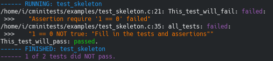

CMiniTests
========================================================================

A header only minimal C testing "framework" with some nicer output:

Simply copy the file `cminitests.h` into the test directory and include it into
the test executable.
A test skeleton is inside the `examples` directory.

Usage
------------------------------------------------------------------------

A simple test executable could look like this:

    #include "cminitests.h"

    char * My_test ()
    {
        // Collect some data
        // ...
        require (data == 1, "Data was not 1");
        // ...
        return NULL;
    }

    void all_tests ()
    {
        CMT_TEST_CASE (My_test,)
        // Further test cases...
    }

    CMT_RUN_TESTS (all_tests)

1. Write a test case `My_test` as a function which returns a string that is
   `NULL` on success or represents an error message.  The `require*` macros will
   test the assertion and return directly from the enclosing function.  They
   will also print a diagnostic message.
2. Register the test with `CMT_TEST_CASE(My_test,)` inside a function
   `all_tests`.  `CMT_TEST_CASE` will test the returned string, count successes
   and failures and print whether the test succeeded or failed.
3. Run the tests with `CMT_RUN_TESTS(all_tests)`.  This will generate a `main`
   function where `all_tests` is called and the overall success rate is printed.
   If some test failed `main` will return with a non-zero value.  This exit code
   can in turn be evaluated by a testing environment (like `CTest`).

If the macros `cmt_set_up` and `cmt_tear_down` are redefined they will be called
before and after each `CMT_TEST_CASE` block, respectively.  This can be done
like this:

    #include "cminitests.h"

    void setup () { /* Set up some globals... */ }
    void tear_down () { /* Clean up those globals... */ }

    #undef cmt_tear_down
    #define cmt_set_up() set_up ()
    #undef cmt_set_up
    #define cmt_tear_down() tear_down ()

    // Tests which access the globals...

Currently, it is assumed that there can be no assertion violation within those
functions.

It is possible to define arguments (a variable number) which can be passed to
the test function.  Those are simply passed via `CMT_TEST_CASE`, e.g.

    char * My_parameterized_test (int x, int y) { /* ... */ }

    void all_tests ()
    {
        CMT_TEST_CASE (My_parameterized_test, 1, 0)
        CMT_TEST_CASE (My_parameterized_test, 2, -1)
        // Further test cases...
    }

    CMT_RUN_TESTS (all_tests)

### Macros to test assertions

- The `message...` parameter is the message string(s) to give if the assertion
failed.
- `require(cond, message...)`: Passes if the expression `cond` evaluates to
*true*.
- `require_not(cond, message...)`: Passes if the expression `cond` evaluates to
*not true*.
- `require_streq(s1, s2, message...)`: Passes if the strings `s1` and `s2` are
*equal* (with respect to `strcmp`).
- `require_strneq(s1, s2, message...)`: Passes if the strings `s1` and `s2` are
*not equal* (with respect to `strcmp`).
- `require_streq_array(sa1, sa2, message...)`: Passes if each pair of
corresponding strings of the argv vectors (`char **` with `NULL` terminator
entry) `sa1` and `sa2` pass for `require_streq`.
- `require_strneq_array(sa1, sa2, message...)`: Passes if each pair of
corresponding strings of the argv vectors `sa1` and `sa2` pass for
`require_strneq`.

Remarks
------------------------------------------------------------------------

You should not use `assert` or other functions which abort the program otherwise
the other tests will not run.

Since each `require*` macro will return directly on failure resources may need
to be used via `cmt_set_up`/`cmt_tear_down`.  Although memory leaks are
acceptable in failed tests, I believe.

________________________________________________________________________

Copyright 2017 A. Johannes RICHTER

Permission is granted to copy, distribute and/or modify this document
under the terms of the GNU Free Documentation License, Version 1.3
or any later version published by the Free Software Foundation;
with no Invariant Sections, no Front-Cover Texts, and no Back-Cover
Texts.  A copy of the license is included in the section entitled "GNU
Free Documentation License".
